# Intune-Zero-to-Managed-Lab
This lab demonstrates how to configure a Zero-to-Managed Windows device lifecycle using Microsoft Intune and Windows Autopilot.

==================================Key components===============================================

Windows Autopilot deployment profile
Enrollment Status Page (ESP)

+++++++++++++Baseline compliance policies++++++++++++++++
BitLocker (device encryption)
Microsoft Defender Antivirus (enabled & up-to-date)
Windows Firewall (enabled)
No local admin rights for normal users
Company Portal deployment

======================Create Entra ID Groups=========================

Create a device group: GRP-Win11-Pilot
Create a user group: GRP-Staff-Pilot
Add test device to the device group and your Entra account to the user group.
📸 Screenshot:

=============================================Tenant-Level Compliance Setting===========================================

Configure Intune’s global compliance rule:
Go to Intune Admin Center → Devices → Compliance policies → Compliance policy settings
Set Mark devices with no compliance policy assigned as = Not compliant
📸 Screenshot:
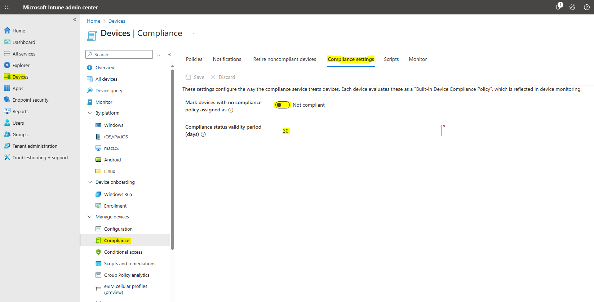

==========================================Create Compliance Policies==================================================

Create and assign Windows 10/11 compliance policies to GRP-Win11-Pilot:
BitLocker Policy → Require BitLocker enabled
Antivirus Policy → Require Microsoft Defender Antivirus
Firewall Policy → Require Windows Firewall enabled
Optional: Minimum OS version & password requirements
📸 Screenshots:
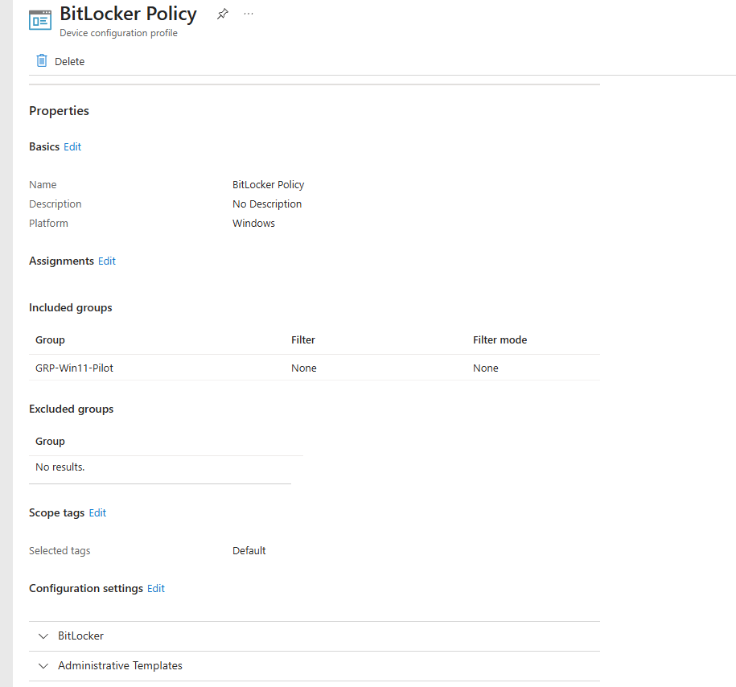
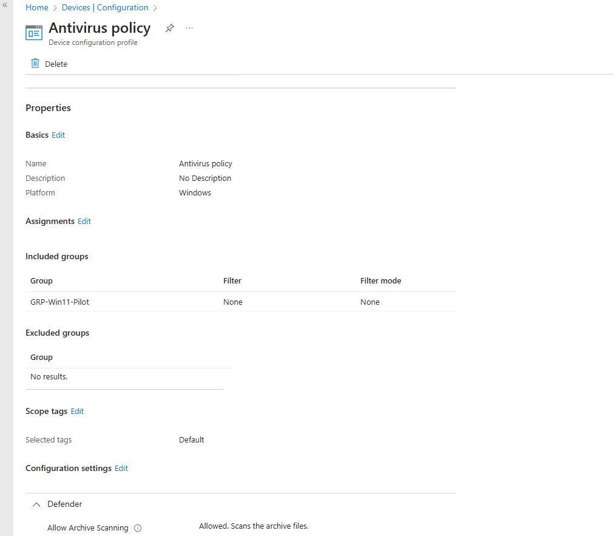
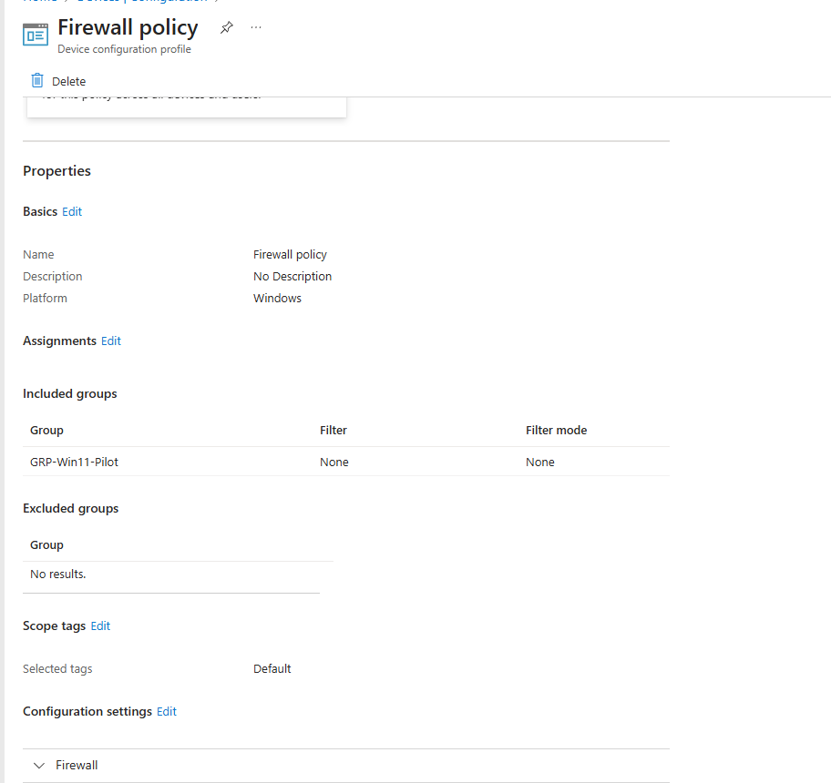

=====================================================Autopilot Deployment Profile===========================================

Create an Autopilot profile (Join type: Entra joined)
Assign it to GRP-Win11-Pilot
📸 Screenshot:
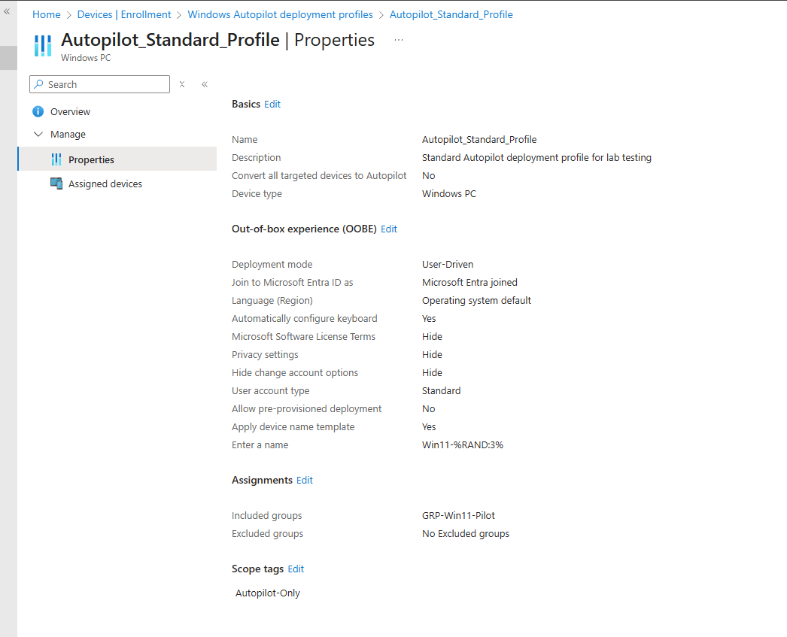

===============================================================Configure Enrollment Status Page (ESP)===========================================

Go to Devices → Windows enrollment → Enrollment Status Page
Create ESP profile and configure:
Block until required apps & policies installed
Add Company Portal as a required app
Assign to GRP-Win11-Pilot
📸 Screenshot:
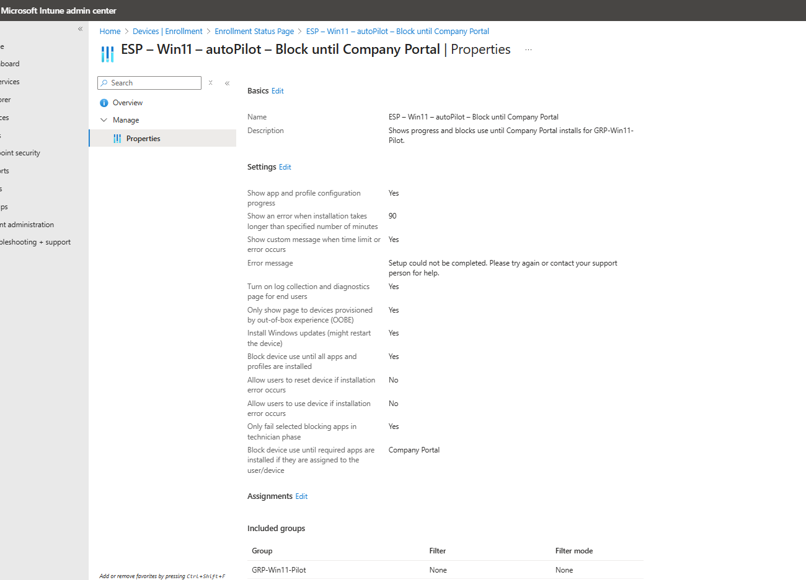

========================================================Deploy Company Portal================================================

Deploy Company Portal from the Microsoft Store (new)
Assign to GRP-Win11-Pilot
📸 Screenshot:
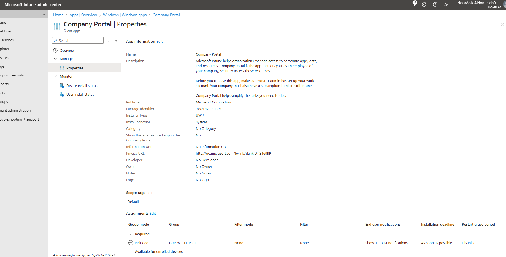

===========================================Verification on Test VM=====================================================

On Windows 11 test VM:
Device enrollment runs Autopilot + ESP
User is blocked until baseline policies applied

Verify:
BitLocker → Enabled
Defender Antivirus → On & up-to-date
Firewall → Enabled
Company Portal → Installed
User is Standard, not local admin

📸 Screenshots:

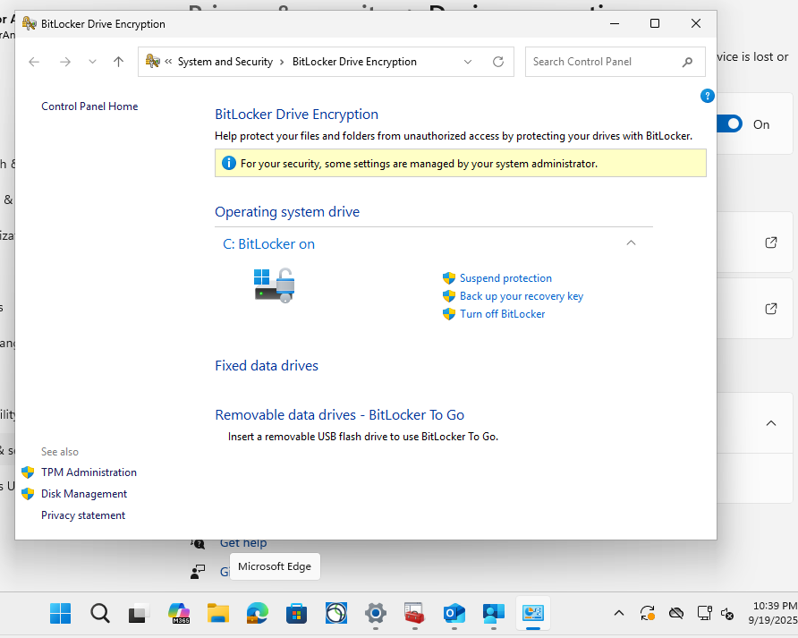
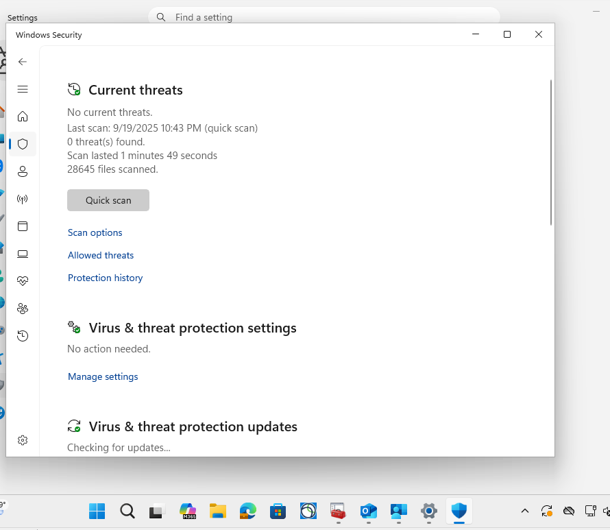
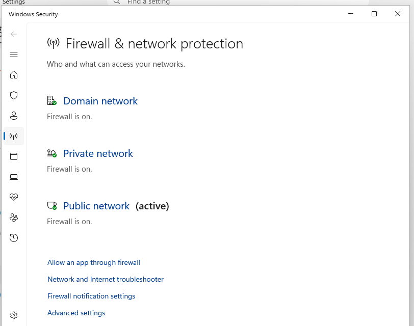
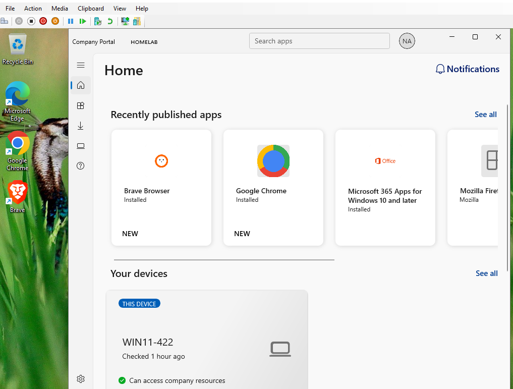
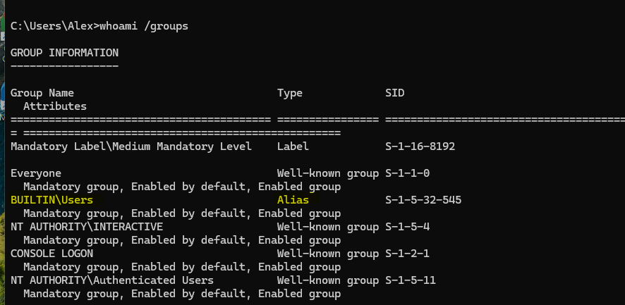

===================================================Outcome==================================================

✅ Device provisioned through Autopilot
✅ ESP enforced → user blocked until baseline ready
✅ Compliance policies applied (BitLocker, Defender, Firewall, Password)
✅ Company Portal installed automatically
✅ Test user has no local admin rights

